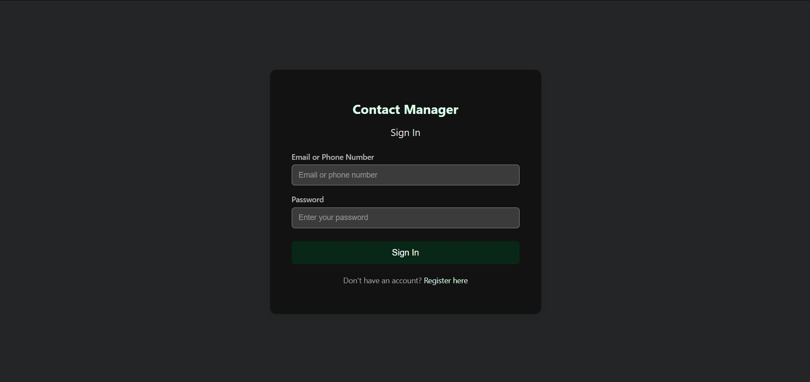
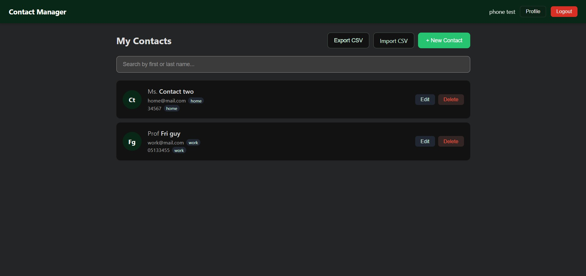
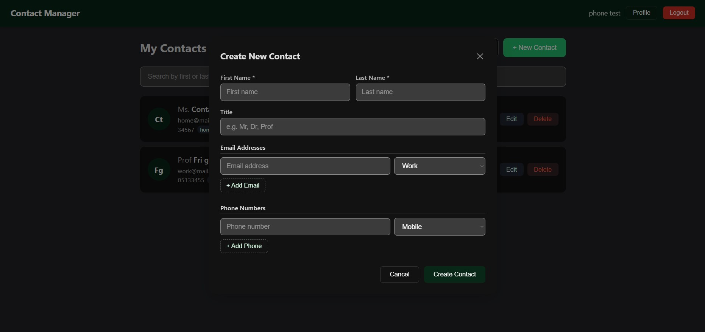
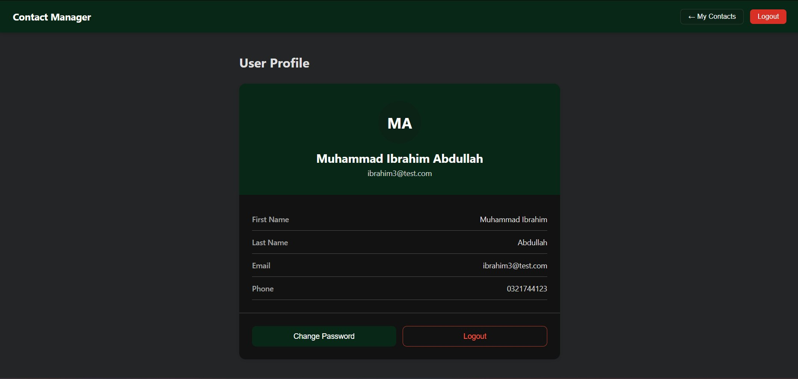
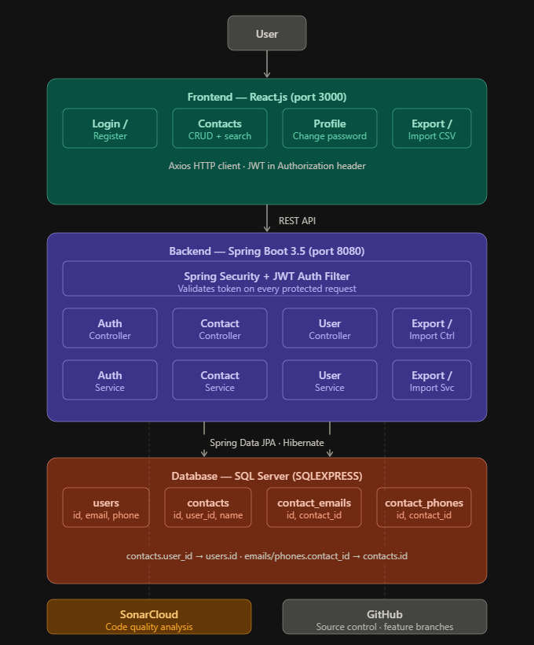

# 👤📇 Contact Management System


A modern full-stack **Contact Management Application** built with **Spring Boot** and **React.js** during a Java internship at **10P Shine**.

The application allows users to securely manage contacts with authentication, pagination, CSV import/export, and support for multiple phone numbers and email addresses.

---

# ✨ Features

| Feature | Description |
|---|---|
| 🔐 JWT Authentication | Secure stateless authentication using Spring Security |
| 👤 User Accounts | Register and login using email or phone number |
| 📇 Contact Management | Create, update, delete, and manage contacts |
| 📱 Multiple Phone Numbers | Store multiple labeled phone numbers |
| 📧 Multiple Emails | Store multiple labeled email addresses |
| 🔍 Search & Pagination | Quickly find contacts with pagination support |
| 📤 CSV Export | Export contacts into CSV files |
| 📥 CSV Import | Bulk import contacts from CSV |
| 🛡️ Validation & Security | Input validation and protected endpoints |
| 🧪 Unit Testing | JUnit 5 and Mockito service-layer tests |
| 📊 Code Quality | SonarCloud integration for static analysis |

---

# 🖼️ Application Preview

## 🔑 Login Page



---

## 📇 Contacts Dashboard



---

## ➕ Add Contact Form



---

## 👤 User Profile



---

# 🏗️ System Architecture



---

# 🛠️ Tech Stack

## Backend
- Java 17
- Spring Boot 3.5
- Spring Security
- JWT Authentication
- Spring Data JPA
- Hibernate
- Microsoft SQL Server
- SLF4J + Logback
- JUnit 5
- Mockito

## Frontend
- React.js
- Axios
- React Router

---

# 📂 Project Structure

```text
Contact-Management-system/
│
├── BackEnd/
│   ├── src/main/java/com/cms/backend/
│   │   ├── controller/        # REST Controllers
│   │   ├── service/           # Business Logic
│   │   ├── repository/        # JPA Repositories
│   │   ├── entity/            # Database Entities
│   │   ├── dto/               # DTO Classes
│   │   ├── security/          # JWT & Security Config
│   │   └── exception/         # Global Exception Handling
│   │
│   ├── src/test/              # Unit Tests
│   └── Database/              # SQL Scripts
│
└── FrontEnd/
    └── cms-frontend/
        └── src/
            ├── pages/         # Frontend Pages
            └── services/      # Axios API Services
```

---

# ⚙️ Getting Started

## Prerequisites

Make sure you have installed:

- Java 17
- Maven 3.9+
- Node.js 18+
- Microsoft SQL Server (SQLEXPRESS)

---

# 🗄️ Database Setup

## 1️⃣ Create Database

```sql
CREATE DATABASE ContactManagementDB;
```

## 2️⃣ Create SQL Login

```sql
CREATE LOGIN cms_user
WITH PASSWORD = 'YourPassword';
```

## 3️⃣ Run Schema Script

Run:

```text
BackEnd/Database/schema.sql
```

using SQL Server Management Studio (SSMS).

---

# 🚀 Backend Setup

## Navigate to Backend

```bash
cd BackEnd
```

## Configure Database Credentials

Update:

```text
src/main/resources/application.properties
```

with your SQL Server credentials.

## Run Backend

```bash
mvn spring-boot:run
```

Backend runs on:

```text
http://localhost:8080
```

---

# 💻 Frontend Setup

## Navigate to Frontend

```bash
cd FrontEnd/cms-frontend
```

## Install Dependencies

```bash
npm install
```

## Start React App

```bash
npm start
```

Frontend runs on:

```text
http://localhost:3000
```

---

# 📡 API Endpoints

| Method | Endpoint | Description | Auth |
|---|---|---|---|
| POST | `/api/auth/register` | Register new user | ✅ |
| POST | `/api/auth/login` | User login | ✅ |
| POST | `/api/auth/change-password` | Change password | ✅ |
| GET | `/api/contacts` | Get paginated contacts | ✅ |
| POST | `/api/contacts` | Create contact | ✅ |
| PUT | `/api/contacts/{id}` | Update contact | ✅ |
| DELETE | `/api/contacts/{id}` | Delete contact | ✅ |
| GET | `/api/contacts/export` | Export contacts to CSV | ✅ |
| POST | `/api/contacts/import` | Import contacts from CSV | ✅ |
| GET | `/api/user/profile` | Get user profile | ✅ |

---

# 📡 Sample API Request

## Login Request

```http
POST /api/auth/login
Content-Type: application/json

{
  "email": "john@example.com",
  "password": "password123"
}
```

## Response

```json
{
  "token": "jwt-token-here"
}
```

---

# 🧪 Running Tests

```bash
cd BackEnd
mvn test
```

Current unit tests cover:
- Authentication Service
- Contact Service

---

# 📊 Code Quality

Code quality is monitored using **SonarCloud**.

🔗 SonarCloud Report:

https://sonarcloud.io/project/overview?id=Ibrahim5570_Contact-Management-system

---

# 📚 Lessons Learned

During this project, I learned:

- Implementing JWT authentication with Spring Security
- Building RESTful APIs using Spring Boot
- Designing relational database schemas
- Handling CSV import/export functionality
- Managing frontend-backend communication with Axios
- Writing maintainable unit tests with Mockito
- Structuring scalable full-stack applications

---

# 🚀 Future Improvements

- 🐳 Docker support
- ☁️ Cloud deployment
- 🔄 CI/CD pipeline
- 👥 Role-based access control
- 🖼️ Contact profile pictures
- 📱 Mobile responsive UI improvements

---

# 👨‍💻 Author

Developed by **Ibrahim** as part of a Java Internship project at **10P Shine**.

If you liked this project, consider giving it a ⭐ on GitHub!
